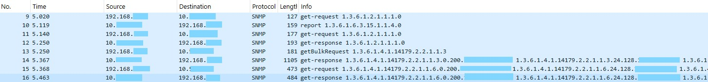
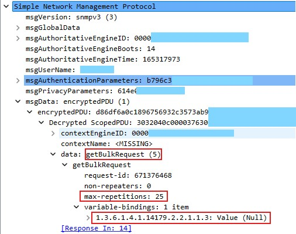
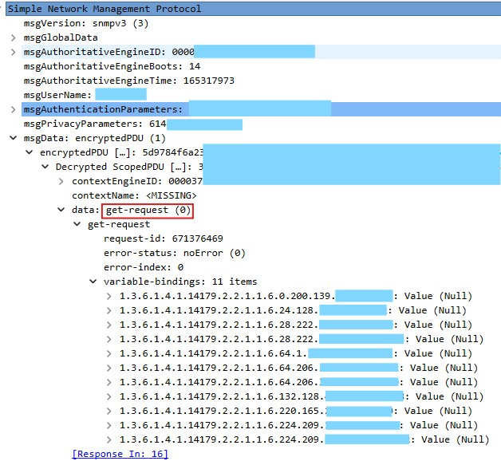
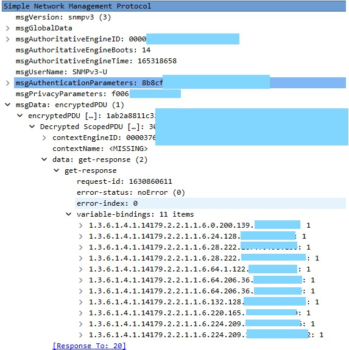
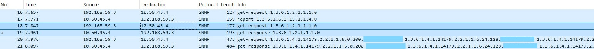
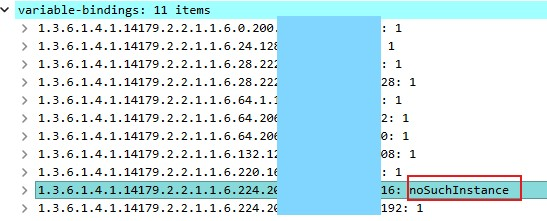

#### Использование библиотеки **PowerSNMPv3** на простом примере создания многоканального сенсора PRTG для мониторинга точек доступа, зарегистрированных на контроллере Cisco C9800.
Нам понадобятся следующие OID’ы:
- Имя точки **1.3.6.1.4.1.14179.2.2.1.1.3**  
- Состояние **1.3.6.1.4.1.14179.2.2.1.1.6** (1 joined 2 not joined 3 downloading)  

Первое что нам потребуется, это получить список точек доступа, обойдя Walk’ом OID **1.3.6.1.4.1.14179.2.2.1.1.3** и сохранив все что после .3 Это MAC адрес точки, добавляя его к другим OID мы можем запросом GET получить данные о ней.  
А можем использовать GET с множеством OID’ов сразу, сэкономив время.  
Есть еще важный момент, дело в том, что после обнаружения точек, мы можем мониторить их состояние, но после того, как точка станет не зарегистрирована, мы ее Walk’ом не обнаружим, поэтому можно сделать так:  
Пока все точки зарегистрированы, запускаем сенсор, он проверяет наличие файла со списком точек, если его нет, то обнаруживает точки и записывает их в файл, и далее опрашиваются уже конкретные точки, и если какой-то OID не существует, то выводим ошибку о том, что точка более не присутствует.
Что хранить в файле, Например, имя точки, и ее MAC в каком-то формате, который потом удобно конвертировать в массив из 6 Int.
Например, строку, разделенную точками.
Итак, пока опустим подробности создания XML для PRTG, а опишем работу с контроллером.  
Нам требуется это описать контроллер – создать структуру типа NetworkDevice c указанием всех необходимых данных, будем для простоты использовать только SNMP версии 3.  
Параметры будем передавать из командной строки:  

    WLCIP := flag.String("ip", "", "C9800 ip address")
    SNMPuser := flag.String("u", "", "SNMP username")
    SNMAuth := flag.String("a", "", "SNMP auth protocol")
    SNMAuthPpass := flag.String("A", "", "SNMP auth password")
    SNMPriv := flag.String("x", "", "SNMP priv protocol")
    SNMPrivPpass := flag.String("X", "", "SNMP priv password")
    APListFilename := flag.String("file", "aplist.xml", "File with APs")
    flag.Parse()

    var devicesipstn Devices

Создаем описание устройства

    var С9800 PowerSNMP.NetworkDevice
    С9800.IPaddress = *WLCIP
    С9800.Port = 161
    С9800.SNMPparameters.Username = *SNMPuser
    С9800.SNMPparameters.SNMPversion = 3
    С9800.SNMPparameters.AuthProtocol = *SNMAuth
    С9800.SNMPparameters.PrivProtocol = *SNMPriv
    С9800.SNMPparameters.AuthKey = *SNMAuthPpass
    С9800.SNMPparameters.PrivKey = *SNMPrivPpass

    //Инициализируем SNTP сессию
    SNMPc9800dev, SNMPc9800Err := PowerSNMP.SNMP_Init(С9800)
    if SNMPc9800Err != nil {
        ErrorInProgram(SNMPc9800Err)
    }

Работу с файлами опустим.  
Если сенсор запускается первый раз, необходимо создать список всех точек, которые зарегистрированы на контроллере, сделаем это при помощи Bulk walk:
Конвертируем нужный OID из строки в нужный вид  

    APNamesOIDint, cmerr := PowerSNMP.ParseOID(OID_APName)
    if cmerr != nil {
        ErrorInProgram(cmerr)
    }

Почему работа с OID в виде массова int лучше – потому что некорректный OID может быть выявлен на ранней стадии, еще до попытки послать запрос.  
    
    APlist, APListErr := SNMPc9800dev.SNMP_BulkWalk(APNamesOIDint)
    if APListErr != nil {
        ErrorInProgram(APListErr)
    }

Теперь обработаем список точек, и сохраним в файле.  
MAC адрес сохраним в виде строки  

    for _, cap := range APlist {
        if len(cap.RSnmpOID) == (len(APNamesOIDint) + 6) {
            //Нам нужны 6 последних байт из возвращенного OID'а
            APMAC := cap.RSnmpOID[len(APNamesOIDint):]

            //Переводим MAC в строку
            MACst := fmt.Sprintf("%d.%d.%d.%d.%d.%d", APMAC[0], APMAC[1], APMAC[2], APMAC[3], APMAC[4], APMAC[5])

            //И имя точки (значение, которое мы сконвертируем в строку)
            APName := PowerSNMP.Convert_Variable_To_String(cap.RSnmpVar)

            //Добавляем точку в список
            Capn := AP{APName: APName, APMAC: MACst}
            devicesipstn.Devices = append(devicesipstn.Devices, Capn)
        }
    }

Перейдем к запросу состояния точек, когда у нас уже есть список.  

	//Теперь перебираем все точки и опрашиваем нужные OID'ы
	for capindex, cap := range devicesipstn.Devices {
		var MACiData []int
		MACDt := strings.Split(cap.APMAC, ".")
		for _, MBc := range MACDt {
			Id, Ie := strconv.Atoi(MBc)
			if Ie != nil {
				if Ie != nil {
					ErrorInProgram(Ie)
				}
			}
			MACiData = append(MACiData, Id)
		}
		//Конвертируем нужный OID из строки в нужный вид
		APStatusOIDint, cmerr := PowerSNMP.ParseOID(OID_AP_OP_Status)
		if cmerr != nil {
			ErrorInProgram(cmerr)
		}
		//Добавляем к OID'у MAC и добавим его к записи об устройстве, оно нам еще пригодится
		APStatusOIDint = append(APStatusOIDint, MACiData...)
		devicesipstn.Devices[capindex].ApStateOid = APStatusOIDint

		//Сохраняем дабы потом опросить одним запросом
		APstatoids = append(APstatoids, PowerSNMP.SNMP_Packet_V2_Decoded_VarBind{RSnmpOID: APStatusOIDint, RSnmpVar: PowerSNMP.SNMPvbNullValue})
	}

Строка 

    APstatoids = append(APstatoids, PowerSNMP.SNMP_Packet_V2_Decoded_VarBind{RSnmpOID: APStatusOIDint, RSnmpVar: PowerSNMP.SNMPvbNullValue})

требует пояснения:  
Тут создается список из структур типа **SNMP_Packet_V2_Decoded_VarBind**, в качестве OID указывается OID получения статуса конкретной точки, а в качестве значения – нулевое значение **PowerSNMP.SNMPvbNullValue**.

Теперь создаем разпрос на все OID'ы сразу:

    AllApStat, AllApStatErr := SNMPc9800dev.SNMP_GetMulti(APstatoids)

	//Результат нужен в виде OID и значение
	OpStDataOIDs := make([]OpstatusData, 0)

	//Теперь обработаем ошибки, чтобы понять по какому из OID небыла получена информация:
	if AllApStatErr != nil {
		PErr, Cerr := PowerSNMP.ParseError(AllApStatErr)
		if Cerr != nil {
			ErrorInProgram(Cerr)
		}
		if PErr.IsFatal {
			if Cerr != nil {
				ErrorInProgram(Cerr)
			}
		} else {
			for _, EmptOids := range PErr.Oids {
				OpStDataOIDs = append(OpStDataOIDs, OpstatusData{FullOID: EmptOids.Failedoid, OpStatus: OPSTATUS_OID_NOTFOUND})
			}
		}
	}

Тут используется функция **ParseError** которая возвращает данные об ошибочных OID и фатальная или не фатальная ошибка.  
Если фатальная, далее можно не продолжать и аварийно завершить программу, а если не фатальная, то перебрать все ошибочные OID’ы и добавить их со специальным значением **OPSTATUS_OID_NOTFOUND** в слайс **OpStDataOIDs**.  

Теперь обработаем все безошибочные данные:

	for _, APOpstatusCrnt := range AllApStat {
		if PowerSNMP.IsInteger(APOpstatusCrnt.RSnmpVar) {
			StatusIVal := PowerSNMP.Convert_bytearray_to_int(APOpstatusCrnt.RSnmpVar.Value)
			OpStDataOIDs = append(OpStDataOIDs, OpstatusData{FullOID: APOpstatusCrnt.RSnmpOID, OpStatus: StatusIVal})
		}
	}

Теперь у нас есть все данные о статусах и данные о том на какие OID'ы ответы не получены.  
Осталось свести все воедино и вернуть результат.

А полный код этого примера можно найти в директории **cmd/c9800aps**

Этот сенсор так же успешно работает не только с C9800, но и со старыми Cisco WLC контроллерами.  
Ниже пример получения данных с реального контроллера.  
Захват кадров до создания файла:  
  
тут мы имеем 8 кадров, первые три это процедура Discovery (разумеется только для версии 3)  
далее заброс на получение списка точек доступа, Bulkwalk (он же getBulkRequest) и на него получен один ответ со всеми точками доступа   
  
Далее посылается запрос Get для получения статуса сразу по всем точкам доступа:  

И ответ на него если нет ошибок:  

Если же опрос производится после создания файла со списком точек доступа, то обмен становится еще короче:   

А теперь посмотрим что случится если одной точки у нас больше нет (рассмотрим только ответ на Get):  

А в ответе для PRTG мы видим что у канала с именем XXX-AP27, значение равно 4, у остальных при этом 1:

    <prtg>
       <error>0</error>
       <text></text>
       <result>
          <channel>XXX-AP02</channel><value>1</value><unit></unit><CustomUnit></CustomUnit><ValueLookup>C9800AP_OPSTATUS_LOOKUP</ValueLookup>
       </result>
       <result>
          <channel>XXX_AP4</channel><value>1</value><unit></unit><CustomUnit></CustomUnit><ValueLookup>C9800AP_OPSTATUS_LOOKUP</ValueLookup>
       </result>
       <result>
          <channel>XXX-APSC</channel><value>1</value><unit></unit><CustomUnit></CustomUnit><ValueLookup>C9800AP_OPSTATUS_LOOKUP</ValueLookup>
       </result>
       <result>
          <channel>XXX-AP20</channel><value>1</value><unit></unit><CustomUnit></CustomUnit><ValueLookup>C9800AP_OPSTATUS_LOOKUP</ValueLookup>
       </result>
       <result>
          <channel>XXX_AP10</channel><value>1</value><unit></unit><CustomUnit></CustomUnit><ValueLookup>C9800AP_OPSTATUS_LOOKUP</ValueLookup>
       </result>
       <result>
          <channel>XXX_AP13</channel><value>1</value><unit></unit><CustomUnit></CustomUnit><ValueLookup>C9800AP_OPSTATUS_LOOKUP</ValueLookup>
       </result>
       <result>
          <channel>XXX_AP03</channel><value>1</value><unit></unit><CustomUnit></CustomUnit><ValueLookup>C9800AP_OPSTATUS_LOOKUP</ValueLookup>
       </result>
       <result>
          <channel>XXX-AP18</channel><value>1</value><unit></unit><CustomUnit></CustomUnit><ValueLookup>C9800AP_OPSTATUS_LOOKUP</ValueLookup>
       </result>
       <result>
          <channel>XXX-AP01</channel><value>1</value><unit></unit><CustomUnit></CustomUnit><ValueLookup>C9800AP_OPSTATUS_LOOKUP</ValueLookup>
       </result>
       <result>
          <channel>XXX-AP27</channel><value>4</value><unit></unit><CustomUnit></CustomUnit><ValueLookup>C9800AP_OPSTATUS_LOOKUP</ValueLookup>
       </result>
       <result>
          <channel>XXX-AP11</channel><value>1</value><unit></unit><CustomUnit></CustomUnit><ValueLookup>C9800AP_OPSTATUS_LOOKUP</ValueLookup>
       </result>
    </prtg>